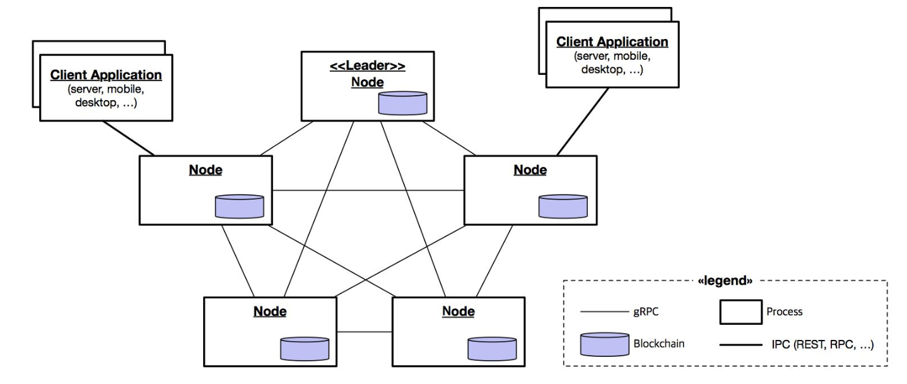
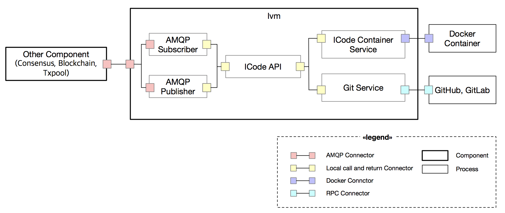
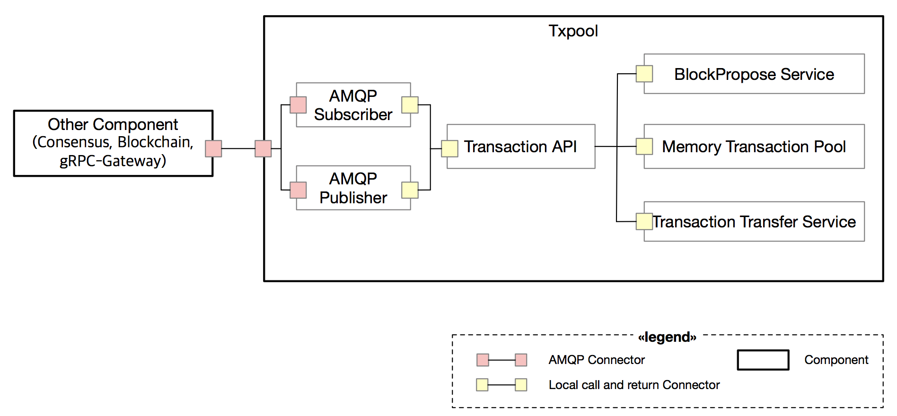

# It-chain 아키텍처 문서

## 1. 개발 배경 및 목적
 
기존 블록체인은 그 규모가 방대하고 복잡하여 지역사회, 소규모 상인연합과 같은 비IT 중소규모 커뮤니티에서 사용하기에 높은 진입장벽을 갖고 있다. 또한 이더리움, 비트코인, 하이퍼레저와 같은 기존의 블록체인은 자신들의 목적에 맞춰 수정하여 사용하기에 어려움이 있다.
그리고 누군가가 블록체인에 대해서 심도 있게 학습하고자 할 때 일반적인 블록체인 이론과 관련된 자료는 많지만 그 이론을 이용해서 실제로 어떻게 블록체인을 구현할 지에 대해서 자세히 알려주는 자료와 오픈소스는 거의 없다. 그나마 존재하는 자료들도 코어가 아닌 Dapp에 대한 것이 대부분이다.
본 프로젝트는 이러한 문제점들을 해결하기 위해서 중소규모 커뮤니티에서 유연하게 수정하여 자신들의 목적에 맞게 활용할 수 있는 경량 맞춤형 블록체인 It-chain을 만든다. It-chain은 수정 용이한 구조를 가진 블록체인으로써 it-chain을 사용하는 사람들이 각자의 필요에 따라서 쉽게 수정할 수 있게 만들고자 한다.
또한 블록체인의 핵심이라고 할 수 있는 PBFT 합의 알고리즘이나 RAFT 리더 선출 알고리즘과같이 일반적인 이론을 통해서는 사람들에게 널리 알려져있지만 실제로 그것을 어떻게 구현할지 고민이 필요한 부분에 대해서 it-chain은 오픈소스로써 수 많은 해결책 중 한 가지를 제시하고자 한다.
It-chain이 이루고자 하는 것은 단순히 하나의 프로젝트에 그치지 않는다. 국내 블록체인 관련 오픈소스 커뮤니티이자 그 활성화를 위한 발걸음이 되고자 한다. 오픈소스는 진입장벽이 높아 프로젝트에 처음 기여하기까지 꽤 오랜 시간이 필요하기 마련이다. 특히, 블록체인 코어 개발에 대한 자료나 커뮤니티 등이 매우 부족하기 때문에 블록체인 관련 오픈소스에 기여하기는 더욱 어려울 수 밖에 없다. 그러나 it-chain은 slack 등의 메신저, 정기적인 오프라인 모임 등 활발한 자료 공유와 커뮤니케이션으로 오픈소스에 한발 더 쉽게 다가갈 수 있게 도울 수 있다.
또한, 코드 구현 뿐만 아니라 깊이 있는 문서화를 통해 사람들로 하여금 이해를 도울 수 있도록 한다. 컴포넌트별 자세한 설명을 문서와 그림을 통해 제공한다. 동작원리 뿐만 아니라 아키텍처, 개발을 위한 여러 정의까지 모두 정리하여 아우르고 있기 때문에 오픈소스에 기여하고자 하는 개발자의 진입 장벽을 조금이라도 낮출 수 있을 것이다.

## 2. 개발 환경 및 개발 언어

- 개발 환경: OSX, Linux
- 개발 언어: Golang 1.9 이상
- 개발 요구 사항: Docker 17.12.0이상, Rabbitmq 3.7.7이상

## 3. 시스템 구성 및 아키텍처

### It-chain Network 아키텍처

It-chain은 CA(Certificate Authority)를 기반으로한 프라이빗(Private) 블록체인(Blockchain)이다. It-chain 네트워크는 리더(Leader)와 일반 노드로 구성되며, 각 노드들은 네트워크에 참여한 모든 노드들과 gRPC로 연결되어 있다. 이 때 리더 노드는 블록 생성과 합의 알고리즘의 시작을 담당하며 주기적으로 교체된다. 나머지 일반 노드들은 리더가 생성한 블록을 검증 및 합의 하며, 클라이언트 어플리케이션(Client Application)으로 부터 전달받은 트랜잭션(Transaction)에 서명(Sign)하여 리더에게 전달한다. 클라이언트 어플리케이션(Client Application)은 It-chain 네트워크 중 임의의 노드에게 요청할 수 있다.

### It-chain Node아키텍처

It-chain 노드 수준 아키텍처 모델은 위 그림과 같다. it-chain  은 6개의 독립적으로 동작하는 핵심 컴포넌트(Component)들로 구성되어 있으며, 각각은 AMQP(Asynchronous Message Queue Protocol)를 통해 커뮤니케이션한다. AMQP는 이벤트 버스 커넥터(Event Bus Connector)이며, 게이트웨이로 들어온 외부 메세지(Message)에 맞춰 내부 핵심 컴포넌트들을 위한 이벤트(Event)를 생성하여 배포한다. 각 핵심 컴포넌트들은 자신들이 이미 등록한 이벤트를 받아서 동작한다. AMQP의 구체적인 구현체는 RabbitMQ  를 사용한다.

it-chain 노드는 2개의 게이트웨이 컴포넌트(Client API Gateway 와 gRPC Gateway)를 통해 외부 네트워크 노드(다른 it-chain  노드 또는 클라이언트 어플리케이션들)와 연결된다.

- Client Gateway  : 클라이언트 어플리케이션(서버, 모바일 앱, 데스크톱 앱 등)들을 위한 API로 REST로 제공된다.
- gRPC Gateway  : it-chain 노드 간의 커뮤니케이션을 위한 서비스로, 블록 싱크, 합의 메세지 등과 같이 블록체인에 관련된 커뮤니케이션을 처리한다.
    
it-chain  의 각 컴포넌트는 동작에 필요한 데이터를 직접 갖고 있다 (Micro Service Architecture 구조에서 참조). 그렇기 때문에 경우에 따라 같은 데이터가 서로 다른 컴포넌트에 중복되어 저장될 수 있으며, 이를 허용한다.    

- TxPool 컴포넌트: 트랜잭션(Transaction)을 임시로 저장하고 관리하는 컴포넌트로, 합의되어 블록에 저장되지 않은 트랜잭션들을 모아둔다.
- Consensus 컴포넌트: 합의를 담당하는 컴포넌트이며, 현재는 PBFT(Practical Byzantine Fault Tolerance) 알고리즘을 따른다.
- BlockChain 컴포넌트: 블록을 생성, 싱크, 검증하고 관리하는 컴포넌트이다.
- Ivm 컴포넌트: it-chain의 스마트 컨트랙트인 iCode 관련 기능을 담당한다.

이와 같이 it-chain은 각각의 완전히 독립적인 컴포넌트들이 모여서 전체 시스템을 구성하기 때문에 사용자의 필요에 따라서 수정이 용이하다는 장점이 있다. 예를 들어 현재 it-chain에서 사용하고 있는 PBFT 합의 알고리즘을 바꾸고 싶은 경우 컨센서스 컴포넌트(Consesus Component)의 도메인 로직만 교체하면 된다. 혹은 블록체인의 블록 구조를 바꾸고 싶은 경우에는 블록체인 컴포넌트(Blockchain Component)의 도메인 로직만 교체하면 그 니즈를 충족시킬 수 있다.

### Consensus

컨센서스 컴포넌트(Consesus Component)는  블록체인 컴포넌트(Blockchain Component)  에서 생성된 블록(Block)에 대해, P2P 네트워크의 구성원들이 블록의 저장 순서에 대해 합의하는 역할을 수행한다. It-chain 에서 이러한 합의 과정은 PBFT 합의 알고리즘을 통해 구현되며, PBFT의 리더는 RAFT 리더 선출 알고리즘을 통해 선출된다.

합의 과정은 선출된 리더가 합의하고자 하는 블록을 제안(Propose) 함으로써 시작되며, 리더가 제안한 블록에 대한 합의 과정에 참여하는 의원(Representative) 의 집합인 의회(Parliament) 가 구성된다. 의회를 구성하는 위원(Representative) 들은 P2P 네트워크를 구성하는 전체 노드들 중 선발되는데, 현재는 블록을 제안(Propose) 하는 시점의 모든 노드들이 선발되는 것을 기본으로 한다. 의회가 구성되고 난 뒤 컨센서스(Consensus)는 블록 합의 요청 이벤트, 블록 합의 완료 이벤트, 합의 메시지(Propose, PreVote, PreCommit) 등을 AMQP를 통해 주고 받는다. State API는 블록 합의를 수행하는 API로, 블록 합의를 요청받으면 합의 메시지를 다른 노드와 주고 받으며 합의를 진행한다. Election API는 리더 선출을 담당하는 API로 리더 후보를 정할 타이머를 시작하거나 리더 후보에 대한 투표(Vote)를 수행한다. Leader API는 리더 업데이트 등의 기능을 수행한다.

### gRPC-Gateway

gRPC-Gateway는 it-chain 네트워크에 참여하는 노드 사이의 통신을 담당한다. gRPC-Gateway는 gRPC Bi-stream을 통해 네트워크의 모든 노드와 커넥션(Connection)을 유지하며, 커넥션(Connection)을 관리한다.

gRPC-Gateway는 같은 노드의 다른 Component와 AMQP(Async Message Queue Protocol)를 사용하여 통신하며, 커넥션(Connection) 관련 기능을 처리하는 Connection API와 다른 노드에게 메세지(Message) 전송요청을 처리하는 Message API가 요청을 받아 처리한다. Connection API와 Message API 모두 gRPC Host service를 사용하여 노드와의 커넥션(Connection)을 관리, 노드에게 메세지(Message)전송 기능을 수행한다.

### API-Gateway

API-Gateway는 클라이언트(Client)로부터의 HTTP 요청을 처리한다. 클라이언트(Client)의 요청은 크게 데이터 변경(Create, Update, Delete)과 조회(Query)로 나뉘어 진다. Query API Handler는 조회(Query)요청을 받아 리포지토리(Repository)로 부터 블록(Block), 트랜잭션(Transaction), ICode, 커넥션(Connection)을 조회하는 기능을 수행한다. API Handler는 데이터 변경요청을 받아 해당 컴포넌트에게 트랜잭션 전송(Transaction Submit), ICode 디플로이(ICode Deploy)같은 요청을 AMQP로 전달한다.

AMQP Handler는 다른 컴포넌트들로 부터 블록(Block), 커넥션(Connection), ICode의 생성, 업데이트, 삭제 이벤트를 받아 독립적으로 조회를 위한 데이터를 DB에 저장하고, Query API는 해당 DB로부터 데이터를 조회하여 반환한다. 이와 같이 API-Gateway를 다른 컴포넌트들과 나누어 데이터의 조회 로직과 데이터의 변경 로직을 분리시켰다.

### Blockchain

블록체인 컴포넌트(Blockchain Component)는 블록의 생성, 저장, 블록체인 동기화 등의 기능을 수행한다. AMQP를 통해 여러 컴포넌트와 협업하며 기능을 수행하는데, 개략적으로 트랜잭션 풀 컴포넌트(TxPool Component)로부터 받은 트랜잭션(Transaction)을 활용하여 블록을 생성하고, 합의를 위해 블록을 컨센서스 컴포넌트(Consensus Component)에 전달한다. 이후 컨센서스 컴포넌트(Consensus Component)로부터 합의를 마친 블록을 전달받아, 검증 과정을 거친 후 저장한다.

자신이 리더 노드일 경우, 트랜잭션 풀 컴포넌트(TxPool Component)로부터 요청을 받아 블록을 생성하고, 컨센서스 컴포넌트(Consensus Component)에 블록의 합의를 요청한다. 컨센서스 컴포넌트(Consensus Component)에서 합의를 완료하면, 네트워크 내 모든 노드는 해당 블록을 블록체인에 저장한다.

블록체인 동기화는 네트워크 내 모든 노드의 블록체인을 동일하게 하기 위한 과정으로, 새로운 노드가 네트워크에 참여할 시 다른 노드와의 블록체인 동기화를 진행한다.

### Ivm

vm 컴포넌트 (ICode Virtual Machine Component) 는 it-chain의 스마트 컨트랙트인 ICode를 실행시키고 관리하는 컴포넌트이다. ICode Container Service를 이용하여 ICode들을 각각의 독립된 도커(Docker)환경에서 관리하고, Git Service를 통해서 ICode를 GitHub, GitLab으로부터 디플로이(Deploy)한다. 디플로이(Deploy)는 Git SSH 프로토콜과 HTTPS 를 지원한다. Git SSH프로토콜을 이용하여 디플로이(Deploy)할때는 선택적으로 SSH 키(Key)를 이용할 수 있다.

각각의 ICode는 디플로이(Deploy) 할 때 해당 ICode의 Git URL과 헤드(Head)의 커밋 해시(commit hash)를 이용하여 ICode 아이디를 부여한다. 따라서 어느 노드에서 실행시켜도 같은 버전 ICode를 디플로이(Deploy) 한다면 같은 ICode 아이디를 갖게된다.  
IVM은 블록체인 컴포넌트(Blockchain Component)의 블록 커밋(Block Committed) 이벤트를 받으면 해당 블록 내 트랜잭션(Transaction)들의 ICode를 실행시킨다. 또한 상태 쿼리(State Query) 요청에 의해 현재 상태(State)의 값을 조회하기 위해 ICode를 실행 시킨다.

### Txpool

Txpool은 제출(Submitted)된 트랜잭션(Transaction)을 검증하고, 자신이 리더 노드일 경우 블록체인 컴포넌트(Blockchain Component)에게 블록 생성 요청을, 일반 노드일 경우 리더 노드에게 트랜잭션(Transaction)을 전달해주는 기능을 수행한다. API-Gateway로 제출(Submitted)된 트랜잭션(Transaction)은 AMQP로 Txpool에 전달되고, Transaction API에 의해 검증 후, Transaction pool에 저장된다. Txpool에는 2개의 배치 스레드(Batch Thread)가 실행되고 있는데, 각각은 Transaction pool에서 트랜잭션(Transaction)을 가져와 리더 노드에게 전송 혹은 블록 생성 요청을 한다.

