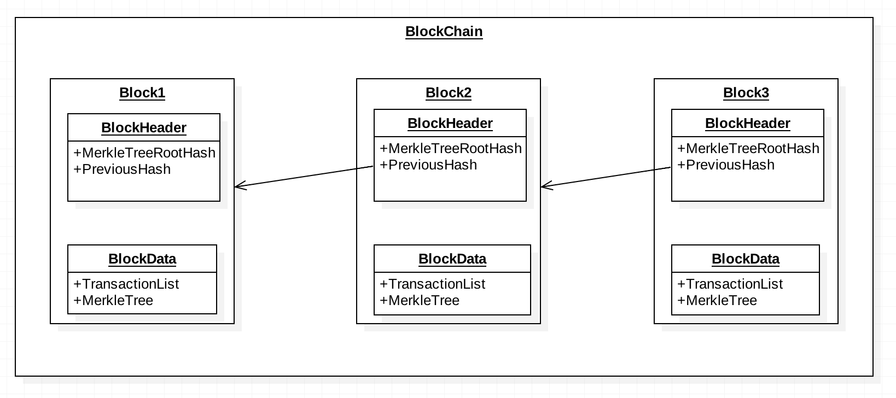
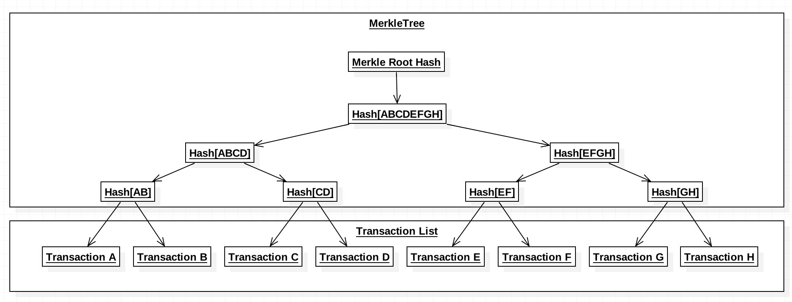

# BlockChain 

- BlockChain

  A blockchain is a continuously growing list of blocks, which are linked by a [hash](https://en.wikipedia.org/wiki/Cryptographic_hash_function) pointer as a link to a previous block.

- Block

  The block consists of a block header and block data, and the next block has a value obtained by hashing the block header for the block structure of the Ledger. 
  The block header has the previous block hash value and the merkle tree root hash value. The block data has a transaction list and has a merkle tree To efficiently manage forgery and tampering of transactions.

- Transaction

  It is an atomic operation that performs Smart Contract. The transaction has an ID of the peer (Node) that actually executes the transaction, a transaction hash value that hashes the transaction header, and TxData which contains the contract contents.

- MerkleTree

  The Merkle Tree consists of a binary tree, and the leaf node is the hash value of the transactions in the transaction list of the block. The root node is a hash value representing the entire transaction that hashes the transaction hash value pair from the leaf node to the end. 
   Merkle Tree is able to check in constant time whether transaction information has changed through merkle tree root hash. In addition, Merkle Tree can effectively manage the validity of all transactions in the ledger because the block header has the Merkle Tree root hash value and the next block has hash value from hashed the block header. And since Merkle Tree can provide the Merkle Path (the Sibling node to the root node of tx), it has the advantage of being able to check the validity of a particular transaction at log time.

  

## Database 
Blockchain can be stored in multiple types of database depend on configuration. For now leveldbhepler and filehelper functions are added. Basic DB implementation uses leveldb. Blocks can be retrieved by block hash and block number and transaction ID. Transactions can be retrieved by transaction ID.If you want to use other database, implement it under blockchainleveldb and edit blockchain_db_interface.

### Related config
Database config is defined in config.yaml as database section

- type

  Type of database. For now only leveldb is supported and little helper function for file is supported.

- leveldb

  Configuration for leveldb
  
  | key          | description                              |
  | ------------ | ---------------------------------------- |
  | default_path | If no other path for leveldb is provided, leveldb data is stored in this path |
  
### LevelDB
Blocks are totally stored in key-value storage leveldb.

- Blocks

  Blocks are serialized to JSON and saved in leveldb. For key block hash and block number are used.  Last block and unconfirmed block are saved for recover.
  
- Transactions

  Also transactions are serialized and saved in leveldb. Basically all transactions are saved together block.  For indexing, block hash that transaction belongs to also saved. Transaction ID is used for key.

| DB name           | Key            | Value                        | Description                              |
| ----------------- | -------------- | ---------------------------- | ---------------------------------------- |
| block_hash        | BlockHash      | Serialized Block             | Save block using blockhash               |
| block_number      | BlockNumber    | Block Hash                   | Save block using block's number          |
| transaction       | Transaction ID | Serialized Transaction       | Save transactions                        |
| unconfirmed_block | BlockHash      | Serialized unconfirmed block | Save unconfirmed block                   |
| util              | Predefined Key | Depends on Key               | DB for multiple usage                    |

- util DB

  Util DB saves multiple things for convenience.
  1) Key : last_block, Value : Serialized last block
  2) Key : unconfirmed_block, Value : Serialized unconfirmed block
  3) Key : transaction ID, Value : Blockhash of block that transaction is stored
  
- Snapshot

  LevelDB snapshot is added for copying world state db which is stored in leveldb.

### File

Block's metadata is saved in leveldb or other key-value database. Block body is saved in file.

- Blocks

  Block's metadata is serialized to JSON and saved in leveldb. Block body data is written into file.
  
- Transactions

  Transaction data is stored in file. For finding, information of the file is stored in key-value database using transaction ID as key.
  

### Author

[@emperorhan](https://github.com/emperorhan)
