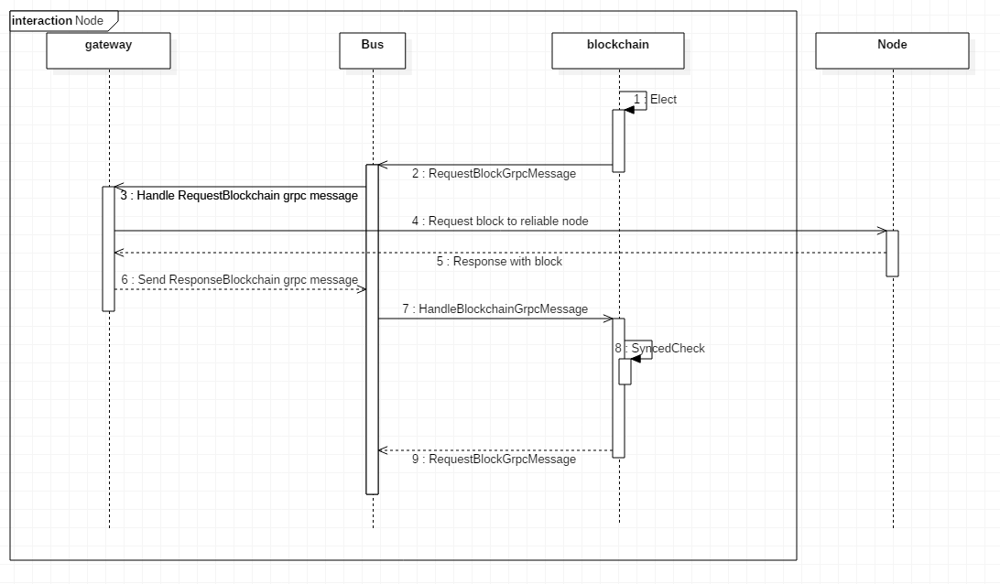
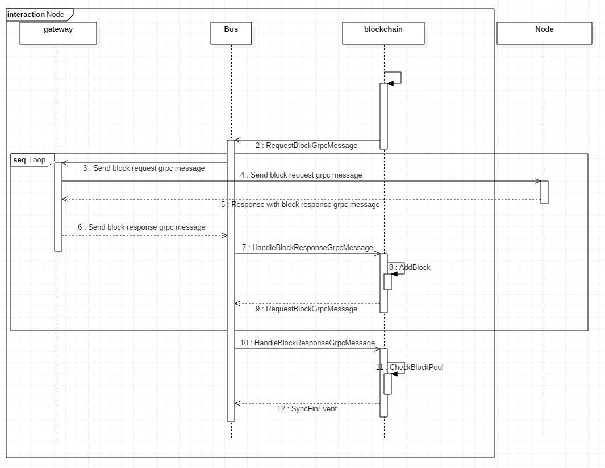
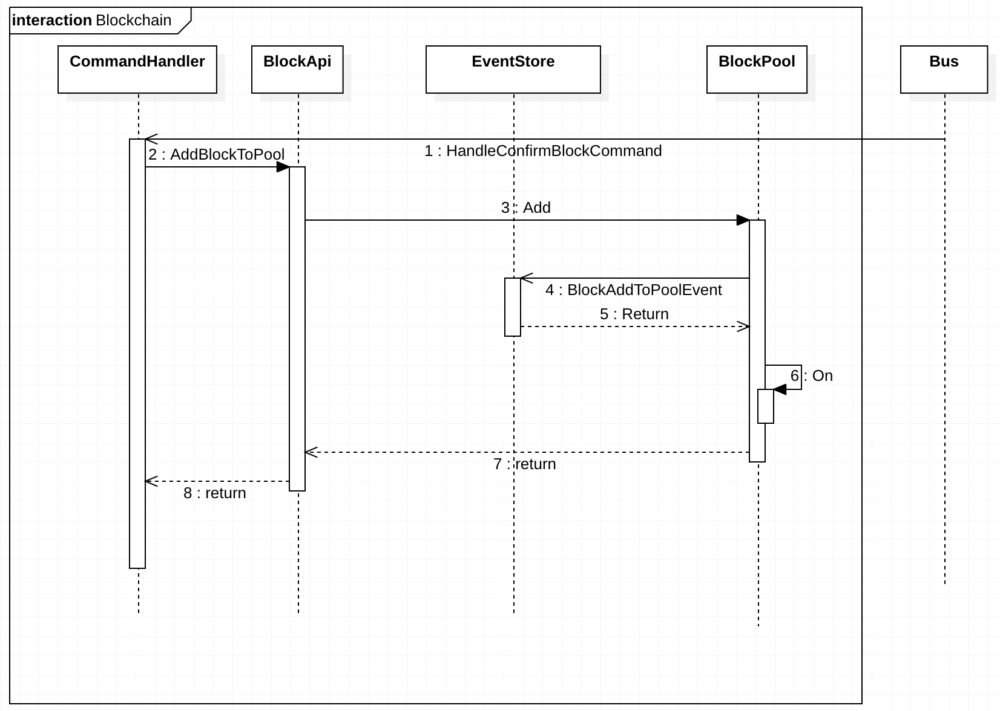

# BlockChain 

- BlockChain

  A blockchain is a continuously growing list of blocks, which are linked by a [hash](https://en.wikipedia.org/wiki/Cryptographic_hash_function) pointer as a link to a previous block.

- Block

  The block consists of a block header and block data, and the next block has a value obtained by hashing the block header for the block structure of the Ledger. 
  The block header has the previous block hash value and the merkle tree root hash value. The block data has a transaction list and has a merkle tree To efficiently manage forgery and tampering of transactions.

- Transaction

  It is an atomic operation that performs Smart Contract. The transaction has an ID of the peer (Node) that actually executes the transaction, a transaction hash value that hashes the transaction header, and TxData which contains the contract contents.

- MerkleTree

  The Merkle Tree consists of a binary tree, and the leaf node is the hash value of the transactions in the transaction list of the block. The root node is a hash value representing the entire transaction that hashes the transaction hash value pair from the leaf node to the end. 
   Merkle Tree is able to check in constant time whether transaction information has changed through merkle tree root hash. In addition, Merkle Tree can effectively manage the validity of all transactions in the ledger because the block header has the Merkle Tree root hash value and the next block has hash value from hashed the block header. And since Merkle Tree can provide the Merkle Path (the Sibling node to the root node of tx), it has the advantage of being able to check the validity of a particular transaction at log time.

  

## Database 
Blockchain can be stored in multiple types of database depend on configuration. For now leveldbhepler and filehelper functions are added. Basic DB implementation uses leveldb. Blocks can be retrieved by block hash and block number and transaction ID. Transactions can be retrieved by transaction ID.If you want to use other database, implement it under blockchainleveldb and edit blockchain_db_interface.

### Related config
Database config is defined in config.yaml as database section

- type

  Type of database. For now only leveldb is supported and little helper function for file is supported.

- leveldb

  Configuration for leveldb
  
  | key          | description                              |
  | ------------ | ---------------------------------------- |
  | default_path | If no other path for leveldb is provided, leveldb data is stored in this path |
  
### LevelDB
Blocks are totally stored in key-value storage leveldb.

- Blocks

  Blocks are serialized to JSON and saved in leveldb. For key block hash and block number are used.  Last block and unconfirmed block are saved for recover.
  
- Transactions

  Also transactions are serialized and saved in leveldb. Basically all transactions are saved together block.  For indexing, block hash that transaction belongs to also saved. Transaction ID is used for key.

| DB name           | Key            | Value                        | Description                              |
| ----------------- | -------------- | ---------------------------- | ---------------------------------------- |
| block_hash        | BlockHash      | Serialized Block             | Save block using blockhash               |
| block_number      | BlockNumber    | Block Hash                   | Save block using block's number          |
| transaction       | Transaction ID | Serialized Transaction       | Save transactions                        |
| unconfirmed_block | BlockHash      | Serialized unconfirmed block | Save unconfirmed block                   |
| util              | Predefined Key | Depends on Key               | DB for multiple usage                    |

- util DB

  Util DB saves multiple things for convenience.
  1) Key : last_block, Value : Serialized last block
  2) Key : unconfirmed_block, Value : Serialized unconfirmed block
  3) Key : transaction ID, Value : Blockhash of block that transaction is stored
  
- Snapshot

  LevelDB snapshot is added for copying world state db which is stored in leveldb.

### File

Block's metadata is saved in leveldb or other key-value database. Block body is saved in file.

- Blocks

  Block's metadata is serialized to JSON and saved in leveldb. Block body data is written into file.
  
- Transactions

  Transaction data is stored in file. For finding, information of the file is stored in key-value database using transaction ID as key.
  

### Author

[@emperorhan](https://github.com/emperorhan)

## Synchronizing Blockchain

Synchronizing takes three steps: Check, Construct, PostConstruct

### Check

In Check step, node takes length of blockchain and last seal from arbitrary node in the network then compare with its own last block's height and seal. if both are same then synchronizing process is done, otherwise proceed to next step: Construct.

### Construct, PostConstruct

In Construct step, we send grpc message that request block to the node which was chosen in Check step (now let call this node as 'Target Node' for just convenience) and with `BlockResponseProtocol` we can receive block that we request. From `AddBlock` we validate that block is right block to add to blockchain. And those process continues until 'last' block of Target Node is added to the blockchain. 'Last' means the height of Target Node's last block we snapped when we start Construct step. In other words, blocks that chained after starting Construct step will not requested to Target Node. Those blocks that were consensused during Synchronizing process will be saved to `BlockPool`. Three procedures: Request, response and add to blockchain are proceed synchronously.

`RequestBlock` worked by using our last block's height. With our last block's height we request next block to Target Node. In the case of node is newbie to network, that node request blocks to Target Node from start to end. Otherwise request blocks from next block of node's last block to the end.

After finishing Construct step, check whether there's next block of synchronizing node's last block which was chained during Construct step. If there's next block, start PostConstruct step. PostConstruct means after finishing construct blockchain with Construct step, add blocks additionally with `BlockPool`'s blocks. After complete PostConstruct step, All of the synchronizing blockchain process completes.

### When synchronizing should proceed?

* When entering node is newbie to network
* When after node re-connected (this case apply timeout)
* At PostConstruct step, when the difference of block pool's block height is larger than one then that of last block which was chained during Construct step.

### Handle Exception Case

* Those nodes which are proceeding synchronization can't participate in consensus. But consensused blocks are saved to BlockPool. And after completing Construct step, those blocks may added to blockchain.
    1. **If the difference of block pool's block height is large as one than that of last block which was chained during Construct step**, then validate previous hash and if valid add to blockchain
    2. **If the difference of block pool's block height is larger than one than that of last block which was chained during Construct step**, then this means that there's node who has block which height is larger than that of last block so select another Target Node then proceed synchronization again until construct block which height is one less than that of block pool's block. If these step done, then continue with 1 or 2 step
*  Construct step can take some times, we should think about disconnecting with network while Construct step proceeds. There's can be two cases: (1) Synchronizing node can be disconnected with network (2) Target Node can be disconnected with network.
    1. **If synchronizing node disconnect with network**, then when connect to network, start synchronization again. For example, if node construct from 101th to 10000th blocks, but disconnect  after construct 500th block. Then when this node connect to network start synchronization from 501th block.
    2. **If Target Node disconnect with network**, this is same as first case, start synchronization again from Check step. Select different Target Node again then construct from node's next block.

### Author

[@zerofruit](https://github.com/zerofruit)

## ConfirmBlockCommand

`ConfirmBlockCommand` is command which sent with consensused block

### How to handle

In blockchain component, if we receive `ConfirmBlockCommand`, save confirmed block to `BlockPool`. This block is not directly saved to blockchain.

`CommandHandler` call `BlockApi` with `AddBlockToPool`.  Using `BlockPool `,  `BlockApi` save confirmed block. After  `BlockPool`  receiving block, save `BlockAddToPoolEvent` to `EventStore`. Finally update itself with `On` function.

 