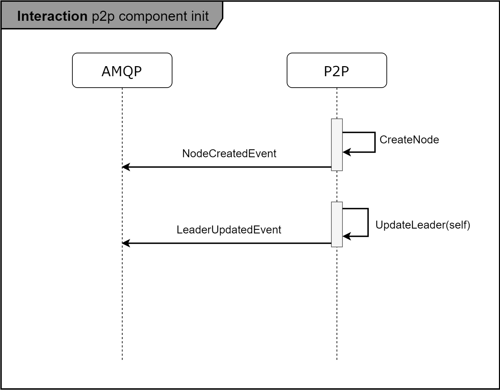
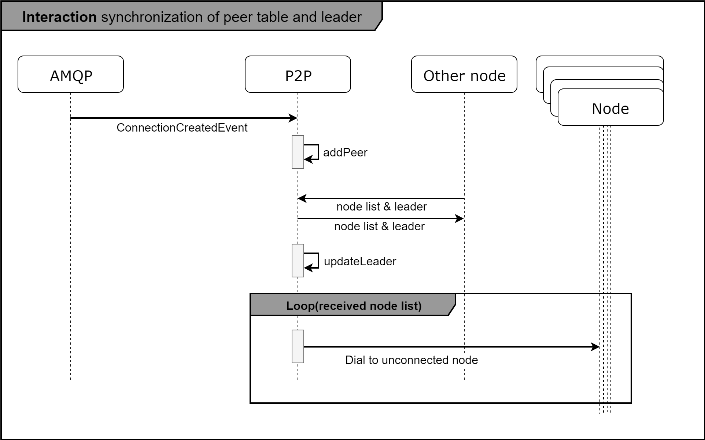

# P2P Component Scenario
**table of contents**

| scenario name                      | content                                     |
|:---------------------------------- |:------------------------------------------- |
| initialize                         | p2p component initialize Scenario           |
| sync peer table and Leader         | Synchronization of peer table and leader    |
| leader election                    | leader election process with RAFT algorithm |
| general node disconnected scenario | node disconnected scenario                  |

## Component Initialization

Above image shows how p2p component initializes

follows steps below
1. create node and save it in repo
2. set itself as leader

## Synchronization of peer table and leader

Above image shows how specific node connect to other whole nodes and have genuine Leader.

follows steps below
1. save node in peer repository when `ConnectionCreatedEvent` occurs
2. receive peer table
3. set connected node's leader as leader if connected node has more node list
4. check node list recursively until there are no more unconnected node and dial to unconnected node

## Leader election when leader node is disconnected

1. Check if disconnected node is a leader when `ConnectionDisconnectedEvent` occurs
2. elect leader

**Leader Election Algorithm with RAFT**
1. Start random timeout function 150ms ~ 300ms
2. Send message having `RequestVoteProtocol` from timed out node to other nodes and alter state to `candidate`
3. If node receives message by `RequestVoteProtocol` before time out, answers with message by `VoteLeaderProtocol` with it's own leader info, reset timeout function
4. If node in the state of `candidate` receives messages with same leader by `VoteLeaderProtocol` as many as the number of nodes, update itself as leader and tell every node that leader has changed

## General node Disconnected Scenario

1. receive `ConnectionDisconnectedEvent`
2. save `NodeDeletedEvent`

### AUTHOR
[@frontalnh](https://github.com/frontalnh)
